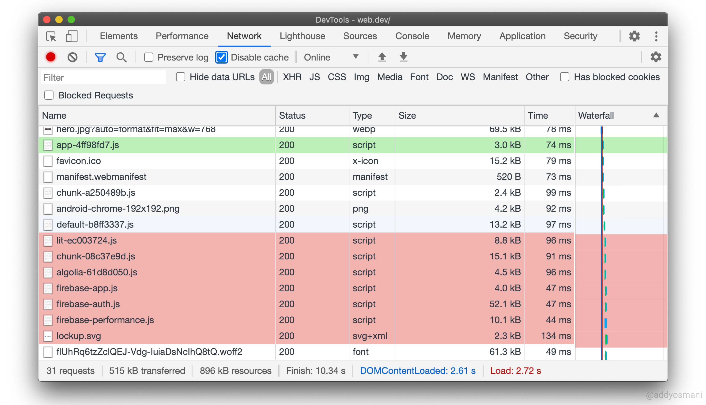

# Holding `shift` while hovering over a request will highlight the initiator in `green` and dependencies in `red`.

[Source from @addyosmani](https://twitter.com/addyosmani/status/1260479896888975362)

[More Chrome Dev tools options](https://developers.google.com/web/tools/chrome-devtools)
