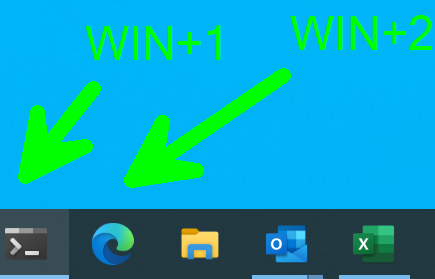

# Using `WIN+1`, `WIN+2`, etc to start application quickly (Windows 10)

Built-in to windows, you if you hit <Windows Key> + a number from 1..9 that will launch the corresponding application in your taskbar.

